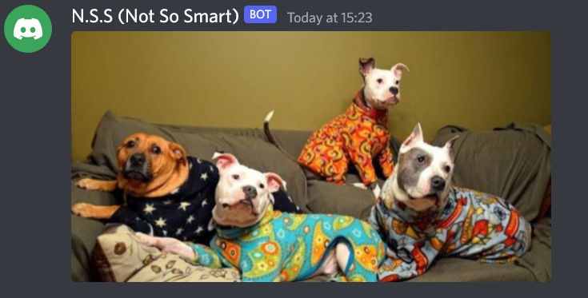

# Python Discord-Bot

This is a discord bot that shows random images of puppies and shows a motivational quote using Python.
## Appendix

Due to the pandemic and the rise in depression, I've seen the trend of self-care and doing things that cheer you up so I figured I'll make a bot that gives the user an aspiring and motivational quote while having the options to look at adorable dogs.

## Lessons Learned
I learned how adorable dogs are. I also find my mood getting better in a positive manner while looking at the images and gifs whenever a special command is used in discord.

I've also learned how to scrape API better and also using less codes to do so as well. There were a few challenges that I've faced where I had trouble accessing JSON objects but after several trials and errors as well as googling, I'm glad to say that I've found my answers.

## Take-aways
It has been quite an interesting journey and I really enjoyed coding and solving complex solutions. While working towards getting a job in the tech industry, I'll be looking forward to work on different problems and further enhancing my skills as a coder.

## Activating Keywords

For inspiring quotes, type:
```
$inspire
```

For fascinating yet adorable dogs, type:
```
$dog
```
## Screenshots
)
)
